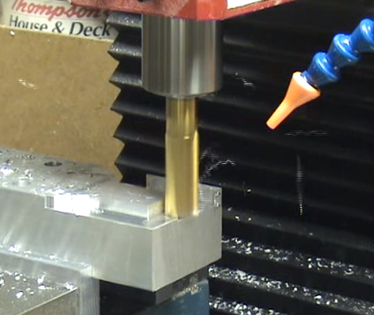

This project was a conversion of a Sieg X2 milling machine from manual to computer controlled, Computer Numerical Control (CNC), that I worked on during my senior year of high school and first few years at Drexel University.  I eventually stopped working on the project due to time constraints.

I have always enjoyed building things and programming, this project was able to satisfy both of those interests.  I gained valuable experience in connecting the digital and physical worlds, as well as about ten to twenty pounds of aluminum chips.

Unfortunately, the website I made following the project is no longer available, but the project's [YouTube channel](https://www.youtube.com/user/jdcncsolutions/videos) still has videos of various stages.

