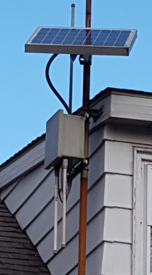

This project was a web application that authenticated devices on WiFi networks prior to allowing them internet access.  I worked on the project during my later years at Drexel University and eventually stopped due to the availability of affordable cellular data plans.

The project was based on the open source [WiFiDog project](http://dev.wifidog.org), but their authentication system had limited functionality, so I decided to create my own.  I developed two models, a premium service, which would charge users for internet access, and a landing page, which would allow restaurants that offered free WiFi to redirect users to their website or display targeted advertising upon first connecting.

Another aspect of the project was solar powered wireless access points, as seen in the photo above.  After several years of operation, I learned that the slight variations in voltage, as the battery was being charged and discharged, lead to a shortened lifespan of the equipment, only 18-24 months as opposed to 5 or more years under normal conditions.  A voltage regulator could fix the issue for a few dollars.

