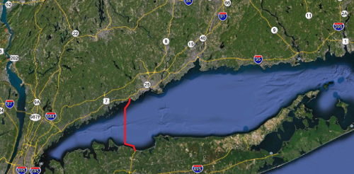

My Senior Design Project at Drexel University was a feasibility analysis of a fixed link crossing the Long Island Sound.  Due to our proximity to New York City, my group members and I determined that there was a need for a link from Long Island, New York to Connecticut that avoided the traffic congestion near New York City, but questioned the financial feasibility of such a project.

After many alternatives that looked at a variety of factors, we determined that a roughly 16 mile crossing would be needed, including both bridge and tunnel sections, for a cost of roughly 7.5 billion dollars with a 3 year construction period.  Having such a large problem, with hundreds of possible options and factors to account for, significantly improved my problem solving skills and ability to effectively work in a group.

[PDF of final project submission](../projects/drexel.pdf)

