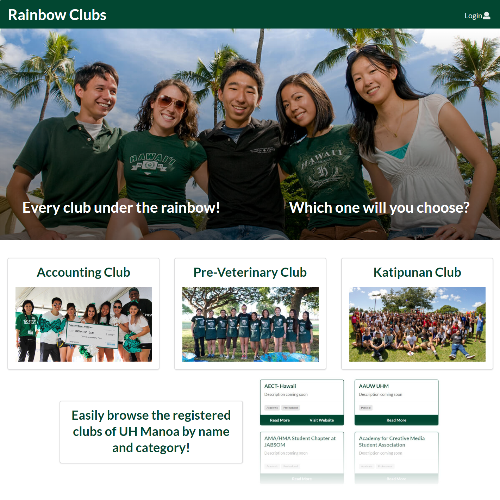

# Project Overview

For my software engineering class at University of Hawaii at Manoa, we were tasked with creating an easy way for students to learn about the almost 300 registered independent organizations on campus.  This project was the culmination of many software engineering concepts we were taught over the semester and tested our ability to use what we had learned in a group, similar to a workplace environment.

[Rainbow Clubs’ GitHub Project Home Page](https://rainbowclubs.github.io/)

# My Contributions

Although I never used Meteor or React prior to this course, I have years of programming and project management experience, which I believe was very beneficial to my group.

I created most of the GitHub issues, including thought out and in-depth descriptions to help make completing the respective issue easier for the assignee.  In addition to issue management, I handled parsing a CSV file containing club information, displaying any changes in the CSV file for review and processing, listing clubs, filtering said listing based on name and type, dynamically changing the landing page depending on what type of user is logged in, and more.

For a full listing of issues I completed, please refer to the [project on GitHub](https://github.com/rainbowclubs/rainbowclubs/issues?q=is%3Aissue+assignee%3Ajohn-dobbs+is%3Aclosed).

# Team Dynamic
This is where things got interesting.

We lacked the ability to effectively communicate as a group, even using the everyone’s preferred means of communication, Slack.  It was very common for our Slack channel to have no replies for days, even with sending messages with a @channel flag to ensure everyone received an email notification.  This presented enormous issues when submissions were due.  In addition to the lack of online communication, team meetings outside of class were nearly non-existent, compounding the issue.

Procrastination and lack of effort was another issue that we never managed to overcome.  After the first milestone submission, when we were busy working on deliverables until literally minutes before the deadline, I thought for sure that we would not find ourselves in the same situation again, but sure enough we did.  This resulted in rushing to get deliverables finished, which lowered the quality of the project.

# Conclusion

Honestly, I did not enjoy this experience very much.  Being self-employed, I usually can simply replace rotten apples before they spoil the whole basket... unfortunately, that was not an option for this project.  Although I did gain experience using Meteor and React, I do not see the usefulness of either in a production environment.

